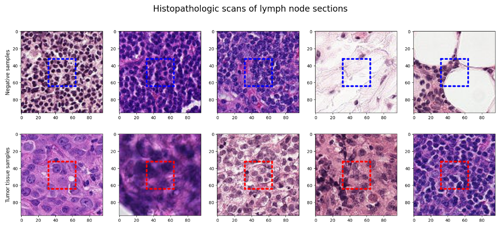
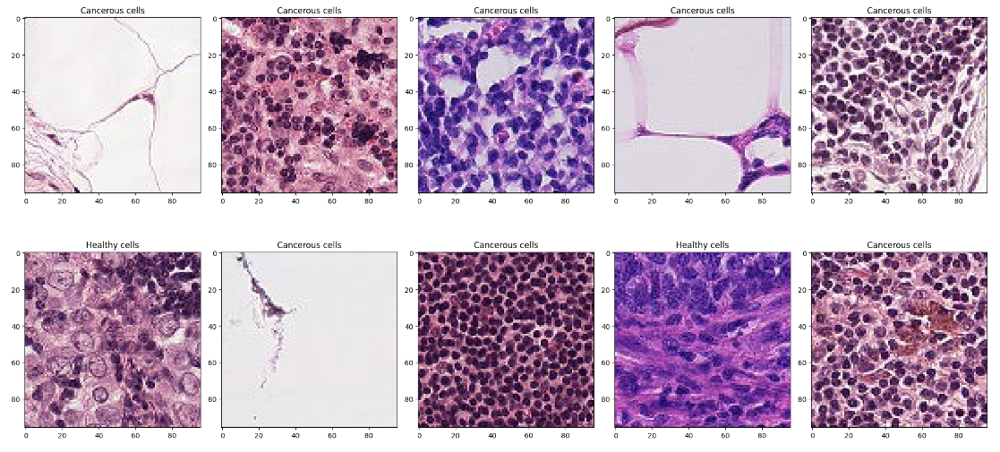
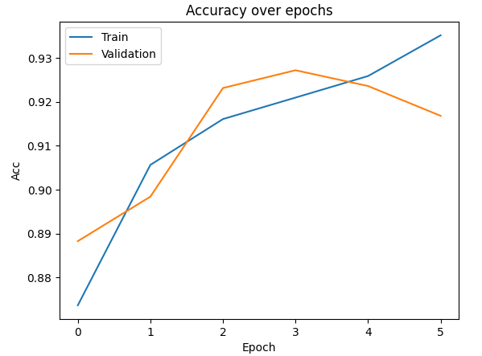
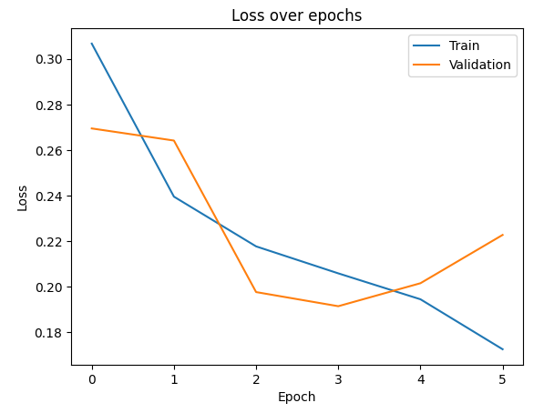

# Project Title: Step-by-Step Guide

## Introduction
In this competition, you must create an algorithm to identify metastatic cancer in small image patches taken from larger digital pathology scans. The data for this competition is a slightly modified version of the PatchCamelyon (PCam) benchmark dataset (the original PCam dataset contains duplicate images due to its probabilistic sampling, however, the version presented on Kaggle does not contain duplicates).

PCam is highly interesting for both its size, simplicity to get started on, and approachability. In the authors' words:

> [PCam] packs the clinically-relevant task of metastasis detection into a straight-forward binary image classification task, akin to CIFAR-10 and MNIST. Models can easily be trained on a single GPU in a couple hours, and achieve competitive scores in the Camelyon16 tasks of tumor detection and whole-slide image diagnosis. Furthermore, the balance between task-difficulty and tractability makes it a prime suspect for fundamental machine learning research on topics as active learning, model uncertainty, and explainability.

In this tutorial, we will start by incoorporating basic Exploratory Data Analysis (EDA) techniques and by using transfer learning to train on the VGG16 model architecture pre-trained with imagenet weights. 

---

## Step 1: Setup Environment

This project will be in Python and will be using the Tensorflow and Scikit-learn libraries. Below displays the full list of packages and versions that are utilized in this project

| Package                      | Version     |
|------------------------------|-------------|
| absl-py                      | 2.0.0       |
| anyio                        | 4.0.0       |
| argon2-cffi                  | 23.1.0      |
| argon2-cffi-bindings         | 21.2.0      |
| arrow                        | 1.3.0       |
| asttokens                    | 2.4.1       |
| astunparse                   | 1.6.3       |
| async-lru                    | 2.0.4       |
| attrs                        | 23.1.0      |
| Babel                        | 2.13.1      |
| beautifulsoup4               | 4.12.2      |
| bleach                       | 6.1.0       |
| cachetools                   | 5.3.2       |
| certifi                      | 2023.7.22   |
| cffi                         | 1.16.0      |
| charset-normalizer           | 3.3.1       |
| colorama                     | 0.4.6       |
| comm                         | 0.1.4       |
| contourpy                    | 1.1.1       |
| cycler                       | 0.12.1      |
| debugpy                      | 1.8.0       |
| decorator                    | 5.1.1       |
| defusedxml                   | 0.7.1       |
| executing                    | 2.0.1       |
| fastjsonschema               | 2.18.1      |
| flatbuffers                  | 23.5.26     |
| fonttools                    | 4.43.1      |
| fqdn                         | 1.5.1       |
| gast                         | 0.5.4       |
| google-auth                  | 2.23.3      |
| google-auth-oauthlib         | 1.0.0       |
| google-pasta                 | 0.2.0       |
| grpcio                       | 1.59.2      |
| h5py                         | 3.10.0      |
| idna                         | 3.4         |
| ipykernel                    | 6.26.0      |
| ipython                      | 8.17.2      |
| isoduration                  | 20.11.0     |
| jedi                         | 0.19.1      |
| Jinja2                       | 3.1.2       |
| joblib                       | 1.3.2       |
| json5                        | 0.9.14      |
| jsonpointer                  | 2.4         |
| jsonschema                   | 4.19.2      |
| jsonschema-specifications    | 2023.7.1    |
| jupyter_client               | 8.5.0       |
| jupyter_core                 | 5.5.0       |
| jupyter-events               | 0.8.0       |
| jupyter-lsp                  | 2.2.0       |
| jupyter_server               | 2.9.1       |
| jupyter_server_terminals     | 0.4.4       |
| jupyterlab                   | 4.0.7       |
| jupyterlab-pygments          | 0.2.2       |
| jupyterlab_server            | 2.25.0      |
| keras                        | 2.14.0      |
| kiwisolver                   | 1.4.5       |
| libclang                     | 16.0.6      |
| Markdown                     | 3.5         |
| MarkupSafe                   | 2.1.3       |
| matplotlib                   | 3.8.0       |
| matplotlib-inline            | 0.1.6       |
| mistune                      | 3.0.2       |
| ml-dtypes                    | 0.2.0       |
| nbclient                     | 0.8.0       |
| nbconvert                    | 7.10.0      |
| nbformat                     | 5.9.2       |
| nest-asyncio                 | 1.5.8       |
| notebook                     | 7.0.6       |
| notebook_shim                | 0.2.3       |
| numpy                        | 1.26.1      |
| oauthlib                     | 3.2.2       |
| opencv-python                | 4.9.0.80    |
| opt-einsum                   | 3.3.0       |
| overrides                    | 7.4.0       |
| packaging                    | 23.2        |
| pandas                       | 2.1.2       |
| pandocfilters                | 1.5.0       |
| parso                        | 0.8.3       |
| Pillow                       | 10.1.0      |
| pip                          | 23.3.2      |
| platformdirs                 | 3.11.0      |
| prometheus-client            | 0.18.0      |
| prompt-toolkit               | 3.0.39      |
| protobuf                     | 4.24.4      |
| psutil                       | 5.9.6       |
| pure-eval                    | 0.2.2       |
| pyasn1                       | 0.5.0       |
| pyasn1-modules               | 0.3.0       |
| pycparser                    | 2.21        |
| Pygments                     | 2.16.1      |
| pyparsing                    | 3.1.1       |
| python-dateutil              | 2.8.2       |
| python-json-logger           | 2.0.7       |
| pytz                         | 2023.3.post1 |
| pywin32                      | 306         |
| pywinpty                     | 2.0.12      |
| PyYAML                       | 6.0.1       |
| pyzmq                        | 25.1.1      |
| referencing                  | 0.30.2      |
| requests                     | 2.31.0      |
| requests-oauthlib            | 1.3.1       |
| rfc3339-validator            | 0.1.4       |
| rfc3986-validator            | 0.1.1       |
| rpds-py                      | 0.10.6      |
| rsa                          | 4.9         |
| scikit-learn                 | 1.3.2       |
| scipy                        | 1.11.3      |
| seaborn                      | 0.13.0      |
| Send2Trash                   | 1.8.2       |
| setuptools                   | 65.5.0      |
| six                          | 1.16.0      |
| sniffio                      | 1.3.0       |
| soupsieve                    | 2.5         |
| stack-data                   | 0.6.3       |
| tensorboard                  | 2.14.1      |
| tensorboard-data-server      | 0.7.2       |
| tensorflow                   | 2.14.0      |
| tensorflow-estimator         | 2.14.0      |
| tensorflow-intel             | 2.14.0      |
| tensorflow-io-gcs-filesystem | 0.31.0      |
| termcolor                    | 2.3.0       |
| terminado                    | 0.17.1      |
| threadpoolctl                | 3.2.0       |
| tinycss2                     | 1.2.1       |
| tornado                      | 6.3.3       |
| tqdm                         | 4.66.1      |
| traitlets                    | 5.13.0      |
| types-python-dateutil        | 2.8.19.14   |
| typing_extensions            | 4.8.0       |
| tzdata                       | 2023.3      |
| uri-template                 | 1.3.0       |
| urllib3                      | 2.0.7       |
| wcwidth                      | 0.2.9       |
| webcolors                    | 1.13        |
| webencodings                 | 0.5.1       |
| websocket-client             | 1.6.4       |
| Werkzeug                     | 3.0.1       |
| wheel                        | 0.41.3      |
| wrapt                        | 1.14.1      |


---

## Step 2: Data Preprocessing

#### Initially, our task entails loading the dataset into a Pandas dataframe. Utilizing Pandas, we can delve into our dataset, extracting valuable insights and crafting visualizations to comprehend our class distributions more effectively. 

```python
df = pd.read_csv('train_labels.csv')
train_dir = 'train'
print(df.info())
print(df.head())
```

Output:

```python
<class 'pandas.core.frame.DataFrame'>
RangeIndex: 220025 entries, 0 to 220024
Data columns (total 2 columns):
 #   Column  Non-Null Count   Dtype 
---  ------  --------------   ----- 
 0   id      220025 non-null  object
 1   label   220025 non-null  int64 
dtypes: int64(1), object(1)
memory usage: 3.4+ MB
None
                                         id  label
0  f38a6374c348f90b587e046aac6079959adf3835      0
1  c18f2d887b7ae4f6742ee445113fa1aef383ed77      1
2  755db6279dae599ebb4d39a9123cce439965282d      0
3  bc3f0c64fb968ff4a8bd33af6971ecae77c75e08      0
4  068aba587a4950175d04c680d38943fd488d6a9d      0

```

Visualizing our class distributions:

```python
label_counts = df.label.value_counts()
plt.pie(label_counts, labels=['No Cancer', 'Cancer'], startangle=90, autopct='%1.1f', colors=['green', 'red'], shadow=True)
plt.figure(figsize=(15,15))
plt.show()
```


Now we will dive into the images of our dataset. These next code blocks are going to display 5 images from each class, and will include a 32x32 box in the center of the image. The purpose of this box is to get a better idea of where our model will be needing to distinguish between the classes, as stated in the dataset description:

> A positive label indicates that the center 32x32px region of a patch contains at least one pixel of tumor tissue. Tumor tissue in the outer region of the patch does not influence the label. This outer region is provided to enable fully-convolutional models that do not use zero-padding, to ensure consistent behavior when applied to a whole-slide image.

```python
def readImage(path):
    # OpenCV reads the image in bgr format by default
    bgr_img = cv2.imread(path)
    # We flip it to rgb for visualization purposes
    b,g,r = cv2.split(bgr_img)
    rgb_img = cv2.merge([r,g,b])
    return rgb_img
```
```python
# random sampling
shuffled_data = shuffle(df)

fig, ax = plt.subplots(2,5, figsize=(20,8))
fig.suptitle('Histopathologic scans of lymph node sections',fontsize=20)
# Negatives
for i, idx in enumerate(shuffled_data[shuffled_data['label'] == 0]['id'][:5]):
    path = os.path.join(train_dir, idx)
    ax[0,i].imshow(readImage(path + '.tif'))
    # Create a Rectangle patch
    box = patches.Rectangle((32,32),32,32,linewidth=4,edgecolor='b',facecolor='none', linestyle=':', capstyle='round')
    ax[0,i].add_patch(box)
ax[0,0].set_ylabel('Negative samples', size='large')
# Positives
for i, idx in enumerate(shuffled_data[shuffled_data['label'] == 1]['id'][:5]):
    path = os.path.join(train_dir, idx)
    ax[1,i].imshow(readImage(path + '.tif'))
    # Create a Rectangle patch
    box = patches.Rectangle((32,32),32,32,linewidth=4,edgecolor='r',facecolor='none', linestyle=':', capstyle='round')
    ax[1,i].add_patch(box)
ax[1,0].set_ylabel('Tumor tissue samples', size='large')

```

Output: 




---

## Step 3: Model Training
We'll navigate through several essential steps during our model training phase.

#### 3.a: Dataframe Adjustments
We need to make a couple adjsutments to our dataframe. 1, add the .tif extensions to the id column of the df. 2, convert the label from a np.int to a str
```python
df['id'] = df['id'] + '.tif'
df['label'] = df['label'].astype(str)
df.head()
```

Output: 
```python
	                                           id	label
0	f38a6374c348f90b587e046aac6079959adf3835.tif	    0
1	c18f2d887b7ae4f6742ee445113fa1aef383ed77.tif	    1
2	755db6279dae599ebb4d39a9123cce439965282d.tif	    0
3	bc3f0c64fb968ff4a8bd33af6971ecae77c75e08.tif    	0
4	068aba587a4950175d04c680d38943fd488d6a9d.tif    	0
```

#### 3.b: Initialize Training Parameters and Create Train and Validiation Generators

```python
train_df, val_df = train_test_split(df, test_size=0.2, stratify=df['label'], random_state=42)
```
```python
img_size = (96, 96)
batch_size = 64
```

```python
train_datagen = ImageDataGenerator(
    rescale=1./255,
    rotation_range=20,
    horizontal_flip=True
)
```

```python
val_datagen = ImageDataGenerator(rescale=1./255)
```

```python
train_generator = train_datagen.flow_from_dataframe(
    train_df,
    directory=train_dir,
    x_col='id',
    y_col='label',
    target_size=img_size,
    batch_size=batch_size,
    class_mode='binary',
    shuffle=True,
    seed=42
)
val_generator = val_datagen.flow_from_dataframe(
    val_df,
    directory=train_dir,
    x_col='id',
    y_col='label',
    target_size=img_size,
    batch_size=batch_size,
    class_mode='binary',
    shuffle=False
)
```
#### 3.c: Check Images Post-Augmentations

```python
## check images after augmentations
def plot_random_samples(generator):
    generator_size = len(generator)
    index=random.randint(0,generator_size-1)
    image,label = generator.__getitem__(index)

    sample_number = 10
    fig = plt.figure(figsize = (20,sample_number))
    for i in range(0,sample_number):
        ax = fig.add_subplot(2, 5, i+1)
        ax.imshow(image[i])
        if label[i]==0:
            ax.set_title("Cancerous cells")
        elif label[i]==1:
            ax.set_title("Healthy cells")
    plt.tight_layout()
    plt.show()
```

```python
plot_random_samples(val_generator)
```



#### 3.d: Create Our Model Using Transfer Learning
We'll harness the power of the VGG16 architecture for our model training, leveraging pre-trained Imagenet weights. By freezing the initial layers and fine-tuning the latter ones, we'll customize the model to our specific needs. Additionally, we'll incorporate our own output layer to adapt the model for our binary classification task.


```python
from tensorflow.keras.applications import VGG16
pretrained = VGG16(weights='imagenet', include_top=False, input_shape=(96,96,3))
pretrained.summary()
```

Output:

```python
Model: "vgg16"
_________________________________________________________________
 Layer (type)                Output Shape              Param #   
=================================================================
 input_1 (InputLayer)        [(None, 96, 96, 3)]       0         
                                                                 
 block1_conv1 (Conv2D)       (None, 96, 96, 64)        1792      
                                                                 
 block1_conv2 (Conv2D)       (None, 96, 96, 64)        36928     
                                                                 
 block1_pool (MaxPooling2D)  (None, 48, 48, 64)        0         
                                                                 
 block2_conv1 (Conv2D)       (None, 48, 48, 128)       73856     
                                                                 
 block2_conv2 (Conv2D)       (None, 48, 48, 128)       147584    
                                                                 
 block2_pool (MaxPooling2D)  (None, 24, 24, 128)       0         
                                                                 
 block3_conv1 (Conv2D)       (None, 24, 24, 256)       295168    
                                                                 
 block3_conv2 (Conv2D)       (None, 24, 24, 256)       590080    
                                                                 
 block3_conv3 (Conv2D)       (None, 24, 24, 256)       590080    
                                                                 
 block3_pool (MaxPooling2D)  (None, 12, 12, 256)       0         
                                                                 
 block4_conv1 (Conv2D)       (None, 12, 12, 512)       1180160   
                                                                 
 block4_conv2 (Conv2D)       (None, 12, 12, 512)       2359808   
                                                                 
 block4_conv3 (Conv2D)       (None, 12, 12, 512)       2359808   
                                                                 
 block4_pool (MaxPooling2D)  (None, 6, 6, 512)         0         
                                                                 
 block5_conv1 (Conv2D)       (None, 6, 6, 512)         2359808   
                                                                 
 block5_conv2 (Conv2D)       (None, 6, 6, 512)         2359808   
                                                                 
 block5_conv3 (Conv2D)       (None, 6, 6, 512)         2359808   
                                                                 
 block5_pool (MaxPooling2D)  (None, 3, 3, 512)         0         
                                                                 
=================================================================
Total params: 14714688 (56.13 MB)
Trainable params: 14714688 (56.13 MB)
Non-trainable params: 0 (0.00 Byte)
_________________________________________________________________
```

Freeze initial layers, train on last 8

```python
for layer in pretrained.layers[:-8]:
    layer.trainable=False

for layer in pretrained.layers:
    print(layer, layer.trainable)
```

Here we are putting the model together, adding in our own output layer

```python
model = Sequential()
model.add(pretrained)
model.add(GlobalAveragePooling2D())
model.add(Dense(256, use_bias=False))
model.add(BatchNormalization())
model.add(Activation('relu'))
model.add(Dropout(0.6))

model.add(Dense(1))
model.add(Activation('sigmoid'))
```

Resulting Model: 

```python
Model: "sequential_2"
_________________________________________________________________
 Layer (type)                Output Shape              Param #   
=================================================================
 vgg16 (Functional)          (None, 3, 3, 512)         14714688  
                                                                 
 global_average_pooling2d_1  (None, 512)               0         
  (GlobalAveragePooling2D)                                       
                                                                 
 dense_1 (Dense)             (None, 256)               131072    
                                                                 
 batch_normalization (Batch  (None, 256)               1024      
 Normalization)                                                  
                                                                 
 activation (Activation)     (None, 256)               0         
                                                                 
 dropout (Dropout)           (None, 256)               0         
                                                                 
 dense_2 (Dense)             (None, 1)                 257       
                                                                 
 activation_1 (Activation)   (None, 1)                 0         
                                                                 
=================================================================
Total params: 14847041 (56.64 MB)
Trainable params: 13111041 (50.01 MB)
Non-trainable params: 1736000 (6.62 MB)
_________________________________________________________________
```
Compile Our Model:

```python
model.compile(optimizer=Adam(learning_rate=0.001), loss='binary_crossentropy', metrics=['accuracy'])
```

Initialize Our Callbacks and Checkpoints:

```python
checkpoint_path = "training_1/cp.ckpt"
checkpoint_dir = os.path.dirname(checkpoint_path)
```

```python
checkpoint = ModelCheckpoint(filepath=checkpoint_path,
                             save_best_only=True,
                             save_weights_only=True,
                             monitor='val_accuracy',
                             mode='max',
                             verbose=1)

early_stopping = EarlyStopping(monitor='loss', patience=5, mode='max', verbose=1)

lr_adjust = ReduceLROnPlateau(monitor='val_loss', patience=1, verbose=1, factor=0.5)
```

#### 3.e: Fit Our Model

```python
history = model.fit(
    train_generator,
    steps_per_epoch=train_generator.samples // batch_size,
    epochs=20,
    validation_data=val_generator,
    validation_steps=val_generator.samples // batch_size,
    callbacks=[lr_adjust, checkpoint, early_stopping]
)
```


---

## Step 4: Model Evaluation

```python
plt.plot(history.history['accuracy'])
plt.plot(history.history['val_accuracy'])
plt.title('Accuracy over epochs')
plt.ylabel('Acc')
plt.xlabel('Epoch')
plt.legend(['Train', 'Validation'], loc='best')
plt.show()
```



```python
plt.plot(history.history['loss'])
plt.plot(history.history['val_loss'])
plt.title('Loss over epochs')
plt.ylabel('Loss')
plt.xlabel('Epoch')
plt.legend(['Train', 'Validation'], loc='best')
plt.show()
```




---

## Step 5: Test Evaluation

#### 5.a: First we need to format our test dataframe in a similar manner of the train dataframe

```python
test_df = pd.DataFrame({'id':os.listdir('test')})
test_df.head()
```

Result:
```python
                                            id
0	00006537328c33e284c973d7b39d340809f7271b.tif
1	0000ec92553fda4ce39889f9226ace43cae3364e.tif
2	00024a6dee61f12f7856b0fc6be20bc7a48ba3d2.tif
3	000253dfaa0be9d0d100283b22284ab2f6b643f6.tif
4	000270442cc15af719583a8172c87cd2bd9c7746.tif
```

#### 5.b: Create Our Test Data Generator
```python
test_datagen = ImageDataGenerator(
    rescale=1. / 255)
test_generator = test_datagen.flow_from_dataframe(
    dataframe=test_df,
    directory='test',
    x_col='id',
    y_col=None,
    target_size=(96,96),
    batch_size=1,
    shuffle=False,
    class_mode=None
)
```

#### 5.c: Use Our Model to Predict on the Test Set

```python
predictions = model.predict(test_generator, verbose=1)
```

#### 5.d: Create our Submission File

```python
predictions = np.transpose(predictions)[0]
submission_df = pd.DataFrame()
submission_df['id'] = test_df['id'].apply(lambda x: x.split('.')[0])
submission_df['label'] = list(map(lambda x: 0 if x < 0.5 else 1, predictions))
submission_df.head()
submission_df.to_csv('submission.csv', index=False)

```

#### 5.e: How did we do?


---

## Conclusion
Final thoughts and any additional tips or resources for further learning.
