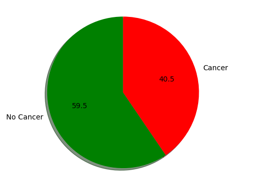

# Project Title: Step-by-Step Guide

## Introduction
In this competition, you must create an algorithm to identify metastatic cancer in small image patches taken from larger digital pathology scans. The data for this competition is a slightly modified version of the PatchCamelyon (PCam) benchmark dataset (the original PCam dataset contains duplicate images due to its probabilistic sampling, however, the version presented on Kaggle does not contain duplicates).

PCam is highly interesting for both its size, simplicity to get started on, and approachability. In the authors' words:

> [PCam] packs the clinically-relevant task of metastasis detection into a straight-forward binary image classification task, akin to CIFAR-10 and MNIST. Models can easily be trained on a single GPU in a couple hours, and achieve competitive scores in the Camelyon16 tasks of tumor detection and whole-slide image diagnosis. Furthermore, the balance between task-difficulty and tractability makes it a prime suspect for fundamental machine learning research on topics as active learning, model uncertainty, and explainability.

In this tutorial, we will start by incoorporating basic Exploratory Data Analysis (EDA) techniques and by using transfer learning to train on the VGG16 model architecture pre-trained with imagenet weights. 

---

## Step 1: Setup Environment

This project will be in Python and will be using the Tensorflow and Scikit-learn libraries. Below displays the full list of packages and versions that are utilized in this project

| Package                      | Version     |
|------------------------------|-------------|
| absl-py                      | 2.0.0       |
| anyio                        | 4.0.0       |
| argon2-cffi                  | 23.1.0      |
| argon2-cffi-bindings         | 21.2.0      |
| arrow                        | 1.3.0       |
| asttokens                    | 2.4.1       |
| astunparse                   | 1.6.3       |
| async-lru                    | 2.0.4       |
| attrs                        | 23.1.0      |
| Babel                        | 2.13.1      |
| beautifulsoup4               | 4.12.2      |
| bleach                       | 6.1.0       |
| cachetools                   | 5.3.2       |
| certifi                      | 2023.7.22   |
| cffi                         | 1.16.0      |
| charset-normalizer           | 3.3.1       |
| colorama                     | 0.4.6       |
| comm                         | 0.1.4       |
| contourpy                    | 1.1.1       |
| cycler                       | 0.12.1      |
| debugpy                      | 1.8.0       |
| decorator                    | 5.1.1       |
| defusedxml                   | 0.7.1       |
| executing                    | 2.0.1       |
| fastjsonschema               | 2.18.1      |
| flatbuffers                  | 23.5.26     |
| fonttools                    | 4.43.1      |
| fqdn                         | 1.5.1       |
| gast                         | 0.5.4       |
| google-auth                  | 2.23.3      |
| google-auth-oauthlib         | 1.0.0       |
| google-pasta                 | 0.2.0       |
| grpcio                       | 1.59.2      |
| h5py                         | 3.10.0      |
| idna                         | 3.4         |
| ipykernel                    | 6.26.0      |
| ipython                      | 8.17.2      |
| isoduration                  | 20.11.0     |
| jedi                         | 0.19.1      |
| Jinja2                       | 3.1.2       |
| joblib                       | 1.3.2       |
| json5                        | 0.9.14      |
| jsonpointer                  | 2.4         |
| jsonschema                   | 4.19.2      |
| jsonschema-specifications    | 2023.7.1    |
| jupyter_client               | 8.5.0       |
| jupyter_core                 | 5.5.0       |
| jupyter-events               | 0.8.0       |
| jupyter-lsp                  | 2.2.0       |
| jupyter_server               | 2.9.1       |
| jupyter_server_terminals     | 0.4.4       |
| jupyterlab                   | 4.0.7       |
| jupyterlab-pygments          | 0.2.2       |
| jupyterlab_server            | 2.25.0      |
| keras                        | 2.14.0      |
| kiwisolver                   | 1.4.5       |
| libclang                     | 16.0.6      |
| Markdown                     | 3.5         |
| MarkupSafe                   | 2.1.3       |
| matplotlib                   | 3.8.0       |
| matplotlib-inline            | 0.1.6       |
| mistune                      | 3.0.2       |
| ml-dtypes                    | 0.2.0       |
| nbclient                     | 0.8.0       |
| nbconvert                    | 7.10.0      |
| nbformat                     | 5.9.2       |
| nest-asyncio                 | 1.5.8       |
| notebook                     | 7.0.6       |
| notebook_shim                | 0.2.3       |
| numpy                        | 1.26.1      |
| oauthlib                     | 3.2.2       |
| opencv-python                | 4.9.0.80    |
| opt-einsum                   | 3.3.0       |
| overrides                    | 7.4.0       |
| packaging                    | 23.2        |
| pandas                       | 2.1.2       |
| pandocfilters                | 1.5.0       |
| parso                        | 0.8.3       |
| Pillow                       | 10.1.0      |
| pip                          | 23.3.2      |
| platformdirs                 | 3.11.0      |
| prometheus-client            | 0.18.0      |
| prompt-toolkit               | 3.0.39      |
| protobuf                     | 4.24.4      |
| psutil                       | 5.9.6       |
| pure-eval                    | 0.2.2       |
| pyasn1                       | 0.5.0       |
| pyasn1-modules               | 0.3.0       |
| pycparser                    | 2.21        |
| Pygments                     | 2.16.1      |
| pyparsing                    | 3.1.1       |
| python-dateutil              | 2.8.2       |
| python-json-logger           | 2.0.7       |
| pytz                         | 2023.3.post1 |
| pywin32                      | 306         |
| pywinpty                     | 2.0.12      |
| PyYAML                       | 6.0.1       |
| pyzmq                        | 25.1.1      |
| referencing                  | 0.30.2      |
| requests                     | 2.31.0      |
| requests-oauthlib            | 1.3.1       |
| rfc3339-validator            | 0.1.4       |
| rfc3986-validator            | 0.1.1       |
| rpds-py                      | 0.10.6      |
| rsa                          | 4.9         |
| scikit-learn                 | 1.3.2       |
| scipy                        | 1.11.3      |
| seaborn                      | 0.13.0      |
| Send2Trash                   | 1.8.2       |
| setuptools                   | 65.5.0      |
| six                          | 1.16.0      |
| sniffio                      | 1.3.0       |
| soupsieve                    | 2.5         |
| stack-data                   | 0.6.3       |
| tensorboard                  | 2.14.1      |
| tensorboard-data-server      | 0.7.2       |
| tensorflow                   | 2.14.0      |
| tensorflow-estimator         | 2.14.0      |
| tensorflow-intel             | 2.14.0      |
| tensorflow-io-gcs-filesystem | 0.31.0      |
| termcolor                    | 2.3.0       |
| terminado                    | 0.17.1      |
| threadpoolctl                | 3.2.0       |
| tinycss2                     | 1.2.1       |
| tornado                      | 6.3.3       |
| tqdm                         | 4.66.1      |
| traitlets                    | 5.13.0      |
| types-python-dateutil        | 2.8.19.14   |
| typing_extensions            | 4.8.0       |
| tzdata                       | 2023.3      |
| uri-template                 | 1.3.0       |
| urllib3                      | 2.0.7       |
| wcwidth                      | 0.2.9       |
| webcolors                    | 1.13        |
| webencodings                 | 0.5.1       |
| websocket-client             | 1.6.4       |
| Werkzeug                     | 3.0.1       |
| wheel                        | 0.41.3      |
| wrapt                        | 1.14.1      |


---

## Step 2: Data Preprocessing

#### Initially, our task entails loading the dataset into a Pandas dataframe. Utilizing Pandas, we can delve into our dataset, extracting valuable insights and crafting visualizations to comprehend our class distributions more effectively. 

```python
df = pd.read_csv('train_labels.csv')
train_dir = 'train'
print(df.info())
print(df.head())
```

Output:

```python
<class 'pandas.core.frame.DataFrame'>
RangeIndex: 220025 entries, 0 to 220024
Data columns (total 2 columns):
 #   Column  Non-Null Count   Dtype 
---  ------  --------------   ----- 
 0   id      220025 non-null  object
 1   label   220025 non-null  int64 
dtypes: int64(1), object(1)
memory usage: 3.4+ MB
None
                                         id  label
0  f38a6374c348f90b587e046aac6079959adf3835      0
1  c18f2d887b7ae4f6742ee445113fa1aef383ed77      1
2  755db6279dae599ebb4d39a9123cce439965282d      0
3  bc3f0c64fb968ff4a8bd33af6971ecae77c75e08      0
4  068aba587a4950175d04c680d38943fd488d6a9d      0

```

Visualizing our class distributions:

```python
label_counts = df.label.value_counts()
plt.pie(label_counts, labels=['No Cancer', 'Cancer'], startangle=90, autopct='%1.1f', colors=['green', 'red'], shadow=True)
plt.figure(figsize=(15,15))
plt.show()
```




---

## Step 3: Model Training

Summary: Overview of the model training process, including code snippets for model architecture, loss functions, and optimization.

---

## Step 4: Evaluation

Summary: Description of evaluation metrics used to assess model performance and interpretation of results.

---

## Step 5: Deployment

Summary: Instructions for deploying the trained model, whether locally or on a cloud platform.

---

## Conclusion
Final thoughts and any additional tips or resources for further learning.
