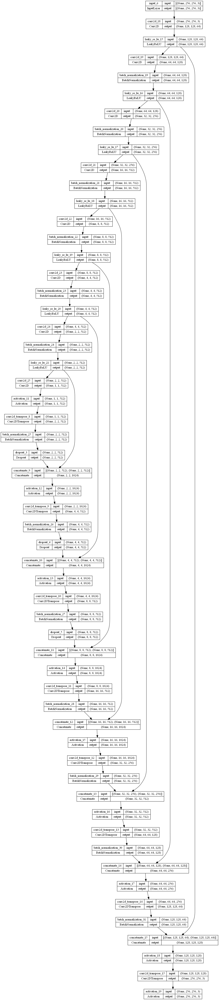
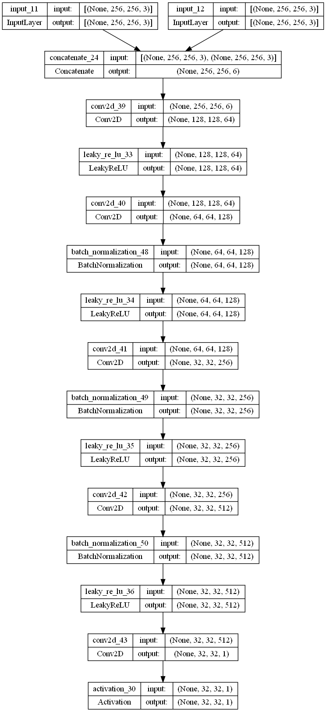

# Satellite Image to Maps Translation

## Overview

This repository contains the implementation of a generative AI model for translating satellite images to maps. The project is based on the research paper titled "Image-to-Image Translation with Conditional Adversarial Networks," which can be found [here](https://arxiv.org/abs/1611.07004).

## Introduction

This project aims to leverage the power of generative adversarial networks (GANs) for translating satellite images into maps. The inspiration for this work comes from the foundational research presented in the paper "Image-to-Image Translation with Conditional Adversarial Networks."

## Model Architecture

### Generator Architecture

The generator follows an encoder-decoder architecture with the following structure:

**Encoder:**
- C64-C128-C256-C512-C512-C512-C512-C512

**Decoder:**
- CD512-CD512-CD512-C512-C256-C128-C64

After the last layer in the decoder, a convolution is applied to map to the number of output channels (3 in general, except in colorization, where it is 2), followed by a Tanh function. BatchNorm is not applied to the first C64 layer in the encoder. All ReLUs in the encoder are leaky, with a slope of 0.2, while ReLUs in the decoder are not leaky.

Additionally, there is a U-Net variant of the architecture, which includes skip connections between each layer i in the encoder and layer n−i in the decoder, where n is the total number of layers. The skip connections concatenate activations from layer i to layer n − i. The decoder structure for the U-Net is:

**U-Net Decoder:**
- CD512-CD1024-CD1024-C1024-C1024-C512-C256-C128

  

### Discriminator Architecture

There are different discriminator architectures based on the receptive field size:

**70 × 70 Discriminator:**
- C64-C128-C256-C512

After the last layer, a convolution is applied to map to a 1-dimensional output, followed by a Sigmoid function. BatchNorm is not applied to the first C64 layer. All ReLUs are leaky, with a slope of 0.2.

**1 × 1 Discriminator:**
- C64-C128 (Note: In this special case, all convolutions are 1 × 1 spatial filters)

**16 × 16 Discriminator:**
- C64-C128

**286 × 286 Discriminator:**
- C64-C128-C256-C512-C512-C512
  

## Contributing

If you want to contribute to this project, please follow the [Contributing Guidelines](CONTRIBUTING.md).

## License

This project is licensed under the [MIT License](LICENSE).
